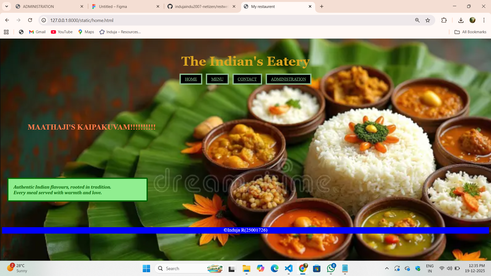
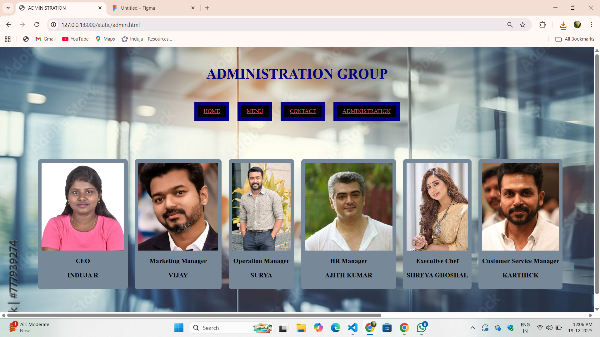
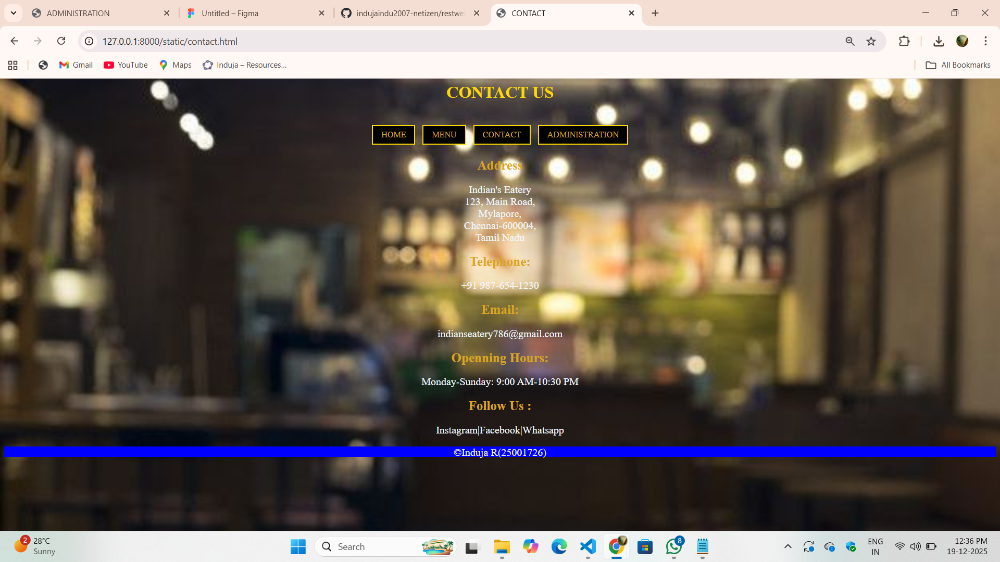

# Ex.06 Restaurant Website
## Date:19-12-2025

## AIM:
To develop a static Restaurant website to display the food items and services provided by them.

## DESIGN STEPS:

### Step 1:
Requirement collection.

### Step 2:
Creating the layout using HTML and CSS.

### Step 3:
Updating the sample content.

### Step 4:
Choose the appropriate style and color scheme.

### Step 5:
Validate the layout in various browsers.

### Step 6:
Validate the HTML code.

### Step 7:
Publish the website in the given URL.

## PROGRAM:
```
home.html

<html>
    <head>
        <title>My restaurent</title>
        <link href="home.css" rel="stylesheet">
    </head>
    <body>
        <br>
        <h1>The Indian's Eatery</h1>
        <div class="navigation">
            <a href="home.html">HOME</a>
            <a href="menu.html">MENU</a>
            <a href="contact.html">CONTACT</a>
            <a href="admin.html">ADMINISTRATION</a>
        </div>
        <br><br>
        <h2>MAATHAJI'S KAIPAKUVAM!!!!!!!!!!</h2>
        <br><br>
        <h3>Authentic Indian flavours, rooted in tradition.
            <br>
            Every meal served with warmth and love.
        </h3>
    </body>
</html>

home.css

body
{
    background-image: url('bgimg.png');
    background-repeat: no-repeat;
    background-size: cover;
}
h1
{
    color:goldenrod;
    font-size: 50px;
    text-align: center;
    font-family: Georgia, 'Times New Roman', Times, serif;
}
.navigation
{
    text-align: center;
}
a
{
    display:inline;
    padding: 8px 16px;
    margin: 5px;
    border: solid 5px;
    color: darkseagreen;
    background-color: black;
}
h2
{
    color: coral;
    padding: 100px;
    font-size: 30px;
}
h3
{
    background-color:lightgreen ;
    padding:20px;
    font-family: Cambria, Cochin, Georgia, Times, 'Times New Roman', serif;
    color: darkgreen;
    border: 5px solid darkgreen;
    font-style: italic;
    margin: 20px ;
    border-radius: 5px;
    width: 500px;
    margin-bottom: 100px;
}

menu.html

<html>
    <head>
        <title>MENU</title>
        <link href="menu.css" rel="stylesheet">
    </head>
    <body>
        <h2>Menu</h2>
        <div class="navigation">
            <a href="home.html">HOME</a>
            <a href="menu.html">MENU</a>
            <a href="contact.html">CONTACT</a>
            <a href="admin.html">ADMINISTRATION</a>
        </div>
        <div class="menubox">
            <div class="food">
            
                <h3>Spl Meals</h3>
                <h4> Price=Rs 359</h4>
            </div>
            <div class="food">
                
                <h3>Dosa</h3>
                <h4> Price=Rs 90</h4>
            </div>
            <div class="food">
                
                <h3>Chapathi With Paneer</h3>
                <h4> Price=Rs 150</h4>
            </div>
            <div class="food">
                
                <h3>Sambar Vadai</h3>
                <h4> Price=Rs 99</h4>
            </div>
            <div class="food">
                
                <h3>Mushroom Rice </h3>
                <h4> Price=Rs 250</h4>
            </div>
            <div class="food">
                
                <h3>vegetable Rice</h3>
                <h4> Price=Rs 265</h4>
            </div>
            <div class="food">
                
                <h3>Kesari(dessert)</h3>
                <h4> Price=Rs 99 </h4>
            </div>
            <div class="food">
                
                <h3>Rasamalai</h3>
                <h4> Price=Rs 110</h4>
            </div>
            

        </div>  
    </body>
    
</html>

menu.css

body
{
    background-image: url('mneubgg.png');
    background-repeat: no-repeat;
    background-size: cover;
}
.navigation
{
    text-align: center;
}
a 
{
    display: inline-block;
    padding: 8px 16px;
    margin: 5px;
    border: 5px solid brown;
    color:coral;
    background-color: black;
    text-decoration: none;
}
h2 {
    text-align: center;
    font-size: 40px;
    color: coral;
}
.menubox {
    display: flex;
    gap: 35px;
    width: 150%;
    margin: 100px;
}

.food {
    background-color: coral;
    padding: 10px;
    text-align: center;
    border-radius: 8px;
    
}

.food img {
    width: 100%;
    height: 150px;
    object-fit: cover;
}

contact.html

<html>
    <head>
        <title>CONTACT</title>
        <link href="contact.css" rel="stylesheet">
    </head>
    <body>
        <h1>CONTACT US</h1>
        <br>
        <div class="navigation">
            <a href="home.html">HOME</a>
            <a href="menu.html">MENU</a>
            <a href="contact.html">CONTACT</a>
            <a href="admin.html">ADMINISTRATION</a>
        </div>
        <h2>Address</h2>
        <p>Indian's Eatery
        <br>
        123, Main Road, 
        <br>
        Mylapore,
        <br>
        Chennai-600004,
        <br>
        Tamil Nadu</p>
        <h2>Telephone:</h2>
        <p>+91 987-654-1230</p>
        <h2>Email:</h2>
        <p>indianseatery786@gmail.com</p>
        <h2>Openning Hours:</h2>
        <p>Monday-Sunday: 9:00 AM-10:30 PM</p>
        <h2>Follow Us :</h2>
        <p>Instagram|Facebook|Whatsapp</p>
    </body>
</html>

contact.css

body
{
    background-image: url('contactbg.jpg');
    background-repeat: no-repeat;
    background-size: cover;
}
.navigation
{
    text-align: center;
}
a 
{
    display: inline-block;
    padding: 8px 16px;
    margin: 5px;
    border: 2px solid gold;
    color: goldenrod;
    background-color: black;
    text-decoration: none;
    
}
h1
{
    color: gold;
    text-align: center;
}
h2{
    color:goldenrod;
    text-align: center;
    font-size: 25px;
}
p
{
    color:aliceblue;
    font-size: 20px;
    text-align: center;
}
footer
{
    background-color:blue;
    text-align: center;
    color: white;
    height: 20px;
    font-size: larger;
}

admin.html

<html>
    <head>
        <title>ADMINISTRATION</title>
        <link href="admin.css" rel="stylesheet">
    </head>
    <body>
        <br>
        <h1>ADMINISTRATION GROUP</h1>
        <br>
        <div class="navigation">
            <a href="home.html">HOME</a>
            <a href="menu.html">MENU</a>
            <a href="contact.html">CONTACT</a>
            <a href="admin.html">ADMINISTRATION</a>
        </div>
        <div class="admin">
            <div class="team">
                
                <h3>CEO</h3>
                <h3>INDUJA R</h3>
            </div>
            <div class="team">
                
                <h3>Marketing Manager</h3>
                <h3>VIJAY</h3>
            </div>
            <div class="team">
                
                <h3>Operation Manager</h3>
                <h3>SURYA</h3>
            </div>
            <div class="team">
                
                <h3>HR Manager</h3>
                <h3>AJITH KUMAR</h3>
            </div>
            <div class="team">
                
                <h3>Executive Chef</h3>
                <h3>SHREYA GHOSHAL</h3>
            </div>
            <div class="team">
                
                <h3>Customer Service Manager</h3>
                <h3>KARTHICK</h3>
            </div>
        
        </div>
    </body>
</html>

admin.css

body
{
    background-image: url('adminbg.jpg');
    background-size: cover;
    background-repeat: no-repeat;
}
h1
{
    text-align: center;
    font-size: 40px;
    color:navy;
}
.navigation
{
    text-align: center;
}
a
{
    display: inline-block;
    padding: 8px 16px;
    margin: 10px;
    border: 10px solid navy;
    color:indianred;
    background-color: black;
}
.admin
{
    display: flex;
    gap: 20px;
    width: 150%;
    margin: 100px;
}
.team
{
    background-color:lightslategrey;
    padding: 10px;
    text-align: center;
    border-radius: 8px;
}
.team img 
{
    width: 100%;
    height: 250px;
    object-fit: cover;
}

```


## OUTPUT:





## RESULT:
The program for designing software company website using HTML and CSS is completed successfully.
